# @effect/workflows: Comprehensive Technical Overview

A complete guide to durable workflow execution with Effect

## Table of Contents

1. [Introduction & Core Concepts](#introduction--core-concepts)
2. [Core API Deep Dive](#core-api-deep-dive)
3. [Advanced Features](#advanced-features)
4. [Architecture & Data Flow](#architecture--data-flow)
5. [Practical Examples](#practical-examples)
6. [Advanced Patterns & Best Practices](#advanced-patterns--best-practices)

---

## Introduction & Core Concepts

### What is @effect/workflows?

@effect/workflows is a powerful library built on top of [Effect](https://effect.website) that provides durable workflow execution capabilities. It enables developers to build reliable, long-running business processes that can survive failures, restarts, and infrastructure issues. The library combines Effect's type-safe functional programming model with workflow orchestration patterns, offering automatic state persistence, compensation mechanisms, and sophisticated error handling.

**Key Design Principles:**

1. **Durability First**: All workflow state is automatically persisted, ensuring workflows can resume after failures
2. **Type Safety**: Full TypeScript support with Schema validation for inputs, outputs, and errors
3. **Compensation Support**: Built-in saga pattern implementation for rollback and cleanup operations
4. **Deterministic Execution**: Workflows produce consistent results regardless of when or where they run
5. **Activity-Based Composition**: Complex workflows are built from simple, testable activity units
6. **Effect Integration**: Seamless integration with Effect's error handling, services, and concurrency

### Core Architecture Overview

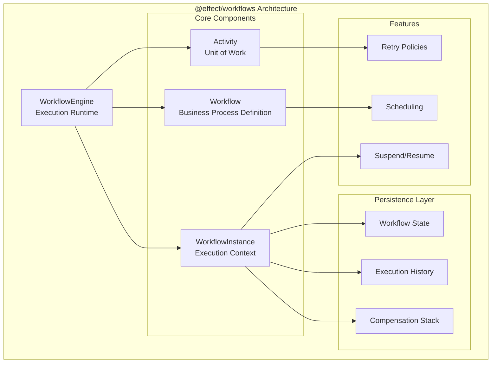

### Fundamental Abstractions

#### 1. **Workflow** - Durable Business Process

A Workflow represents a long-running business process that can span multiple activities, handle failures gracefully, and maintain state across executions.

```typescript
import { Workflow, Activity, Schema } from "@effect/workflows"
import { Effect } from "effect"

// Define workflow payload schema
const OrderPayload = Schema.Struct({
  orderId: Schema.String,
  customerId: Schema.String,
  items: Schema.Array(Schema.Struct({
    productId: Schema.String,
    quantity: Schema.Number,
    price: Schema.Number
  })),
  totalAmount: Schema.Number
})

// Create a workflow
const processOrderWorkflow = Workflow.make({
  name: "process-order",
  payload: OrderPayload,
  success: Schema.Struct({
    orderId: Schema.String,
    status: Schema.Literal("completed"),
    trackingNumber: Schema.String
  }),
  error: Schema.Union(
    Schema.Struct({ _tag: Schema.Literal("PaymentFailed"), reason: Schema.String }),
    Schema.Struct({ _tag: Schema.Literal("InventoryUnavailable"), items: Schema.Array(Schema.String) })
  ),
  idempotencyKey: (payload) => payload.orderId,
  suspendedRetrySchedule: Schedule.exponential("1 minute")
})
```

#### 2. **Activity** - Unit of Work

Activities are the building blocks of workflows. They represent individual units of work that can be retried, have their own error handling, and produce typed results.

```typescript
// Define an activity for payment processing
const chargePaymentActivity = Activity.make({
  name: "charge-payment",
  success: Schema.Struct({
    transactionId: Schema.String,
    amount: Schema.Number,
    timestamp: Schema.Date
  }),
  error: Schema.Struct({
    _tag: Schema.Literal("PaymentError"),
    reason: Schema.String,
    retryable: Schema.Boolean
  }),
  execute: Effect.gen(function* () {
    const { customerId, amount } = yield* Activity.payload(OrderPayload)
    
    // Simulate payment processing
    const result = yield* PaymentService.charge({
      customerId,
      amount,
      idempotencyKey: yield* Activity.executionId
    })
    
    return {
      transactionId: result.id,
      amount: result.amount,
      timestamp: new Date()
    }
  })
})
```

#### 3. **WorkflowEngine** - Execution Runtime

The WorkflowEngine manages workflow execution, state persistence, and activity orchestration:

```typescript
import { WorkflowEngine } from "@effect/workflows"

// Create engine with persistence configuration
const engine = WorkflowEngine.make({
  persistence: {
    // Configure state storage backend
    stateStore: PostgresStateStore,
    historyStore: PostgresHistoryStore
  },
  concurrency: {
    maxConcurrentWorkflows: 100,
    maxConcurrentActivities: 50
  }
})

// Execute a workflow
const result = yield* processOrderWorkflow.execute({
  orderId: "ORD-123",
  customerId: "CUST-456",
  items: [...],
  totalAmount: 99.99
}).pipe(
  Effect.provide(engine)
)
```

#### 4. **WorkflowInstance** - Execution Context

WorkflowInstance provides access to the current execution context within activities and workflows:

```typescript
const contextAwareActivity = Activity.make({
  name: "context-aware-activity",
  execute: Effect.gen(function* () {
    // Access execution context
    const executionId = yield* WorkflowInstance.executionId
    const attempt = yield* Activity.currentAttempt
    const workflowName = yield* WorkflowInstance.workflowName
    
    console.log(`Executing ${workflowName} (${executionId}) - Attempt ${attempt}`)
    
    // Perform work with context awareness
    return yield* performWork({ executionId, attempt })
  })
})
```

#### 5. **Compensation** - Saga Pattern Support

Workflows support compensation (saga pattern) for handling rollback scenarios:

```typescript
const orderWorkflowWithCompensation = processOrderWorkflow.toLayer((payload, executionId) =>
  Effect.gen(function* () {
    // Charge payment with compensation
    const payment = yield* chargePaymentActivity.pipe(
      Workflow.withCompensation((paymentResult, failureCause) =>
        Effect.gen(function* () {
          yield* Effect.log(`Refunding payment ${paymentResult.transactionId}`)
          yield* PaymentService.refund(paymentResult.transactionId)
        })
      )
    )
    
    // Reserve inventory with compensation
    const reservation = yield* reserveInventoryActivity.pipe(
      Workflow.withCompensation((reservationResult, failureCause) =>
        Effect.gen(function* () {
          yield* Effect.log(`Releasing inventory reservation ${reservationResult.reservationId}`)
          yield* InventoryService.releaseReservation(reservationResult.reservationId)
        })
      )
    )
    
    // Ship order (if this fails, compensations run automatically)
    const shipping = yield* shipOrderActivity
    
    return {
      orderId: payload.orderId,
      status: "completed" as const,
      trackingNumber: shipping.trackingNumber
    }
  })
)
```

### Workflow Lifecycle

The workflow lifecycle includes several key phases:

1. **Initialization**: Workflow is created with unique execution ID
2. **Execution**: Activities are executed in sequence or parallel
3. **State Persistence**: State is saved after each activity
4. **Suspension**: Workflows can be suspended on certain conditions
5. **Resumption**: Suspended workflows resume from last checkpoint
6. **Compensation**: On failure, compensation stack is executed
7. **Completion**: Final result is persisted and returned

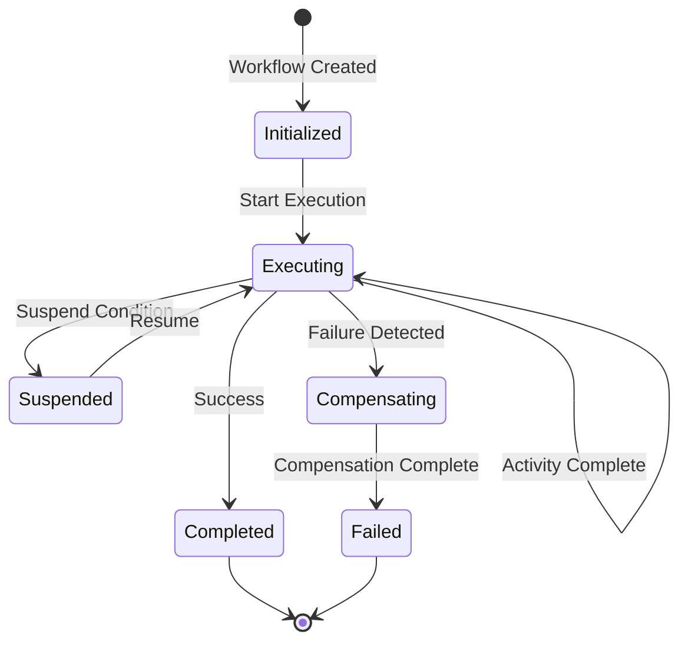

### Key Benefits

**1. Reliability**
- Automatic state persistence ensures no lost work
- Built-in retry mechanisms handle transient failures
- Compensation support for complex rollback scenarios

**2. Observability**
- Full execution history tracking
- Detailed activity logs and timings
- Integration with Effect's tracing system

**3. Type Safety**
- Schema validation for all inputs/outputs
- Compile-time guarantees for workflow composition
- Type-safe error handling

**4. Scalability**
- Horizontal scaling of workflow execution
- Efficient state management
- Configurable concurrency limits

**5. Developer Experience**
- Intuitive API design
- Excellent TypeScript support
- Comprehensive error messages

### Comparison with Other Workflow Engines

| Feature | @effect/workflows | Temporal | AWS Step Functions | Apache Airflow |
|---------|------------------|----------|-------------------|----------------|
| Type Safety | ✅ Full TypeScript | ⚠️ Limited | ❌ JSON-based | ❌ Python dynamic |
| Local Development | ✅ Easy | ⚠️ Complex setup | ❌ Cloud-only | ⚠️ Heavy setup |
| Compensation | ✅ Built-in | ✅ Saga pattern | ❌ Manual | ❌ Manual |
| Effect Integration | ✅ Native | ❌ | ❌ | ❌ |
| Schema Validation | ✅ Built-in | ❌ Manual | ⚠️ Limited | ❌ Manual |
| Open Source | ✅ | ✅ | ❌ | ✅ |

### When to Use @effect/workflows

@effect/workflows is ideal for:

- **E-commerce Systems**: Order processing, payment flows, fulfillment
- **Financial Services**: Transaction processing, reconciliation, compliance workflows
- **Data Pipelines**: ETL processes, batch processing, data validation
- **Microservice Orchestration**: Coordinating multiple services in distributed systems
- **Human-in-the-loop Processes**: Approval workflows, document processing
- **Integration Workflows**: API orchestration, webhook processing, event handling

### Getting Started

```typescript
import { Workflow, Activity, WorkflowEngine } from "@effect/workflows"
import { Effect, Layer, Schema } from "effect"

// 1. Define your activities
const validateOrderActivity = Activity.make({
  name: "validate-order",
  execute: Effect.succeed({ valid: true })
})

// 2. Create your workflow
const simpleWorkflow = Workflow.make({
  name: "simple-order-workflow",
  payload: Schema.Struct({ orderId: Schema.String }),
  idempotencyKey: (payload) => payload.orderId
})

// 3. Implement workflow logic
const workflowLayer = simpleWorkflow.toLayer((payload) =>
  Effect.gen(function* () {
    yield* validateOrderActivity
    return { success: true }
  })
)

// 4. Execute with engine
const program = Effect.gen(function* () {
  const result = yield* simpleWorkflow.execute({ orderId: "123" })
  return result
}).pipe(
  Effect.provide(workflowLayer),
  Effect.provide(WorkflowEngine.layerDefault)
)
```

This foundation sets the stage for building robust, production-ready workflow systems with @effect/workflows.

---

## Core API Deep Dive

### Workflow - Durable Business Process Definition

The `Workflow` interface is the central abstraction for defining durable business processes. It encapsulates the workflow definition, execution logic, and integration with the workflow engine.

#### Interface Definition

```typescript
interface Workflow<
  Name extends string,
  Payload extends AnyStructSchema,
  Success extends Schema.Schema.Any,
  Error extends Schema.Schema.All,
> {
  readonly name: Name
  readonly payloadSchema: Payload
  readonly successSchema: Success
  readonly errorSchema: Error
  readonly annotations: Context.Context<never>

  // Execute the workflow with the given payload
  readonly execute: <const Discard extends boolean = false>(
    payload: Schema.Simplify<Schema.Struct.Constructor<Payload["fields"]>>,
    options?: { readonly discard?: Discard }
  ) => Effect.Effect<
    Discard extends true ? void : Success["Type"],
    Discard extends true ? never : Error["Type"],
    WorkflowEngine | Payload["Context"] | Success["Context"] | Error["Context"]
  >

  // Interrupt a workflow execution
  readonly interrupt: (executionId: string) => Effect.Effect<void, never, WorkflowEngine>

  // Resume a suspended workflow
  readonly resume: (executionId: string) => Effect.Effect<void, never, WorkflowEngine>

  // Create a layer with workflow implementation
  readonly toLayer: <R>(
    execute: (
      payload: Payload["Type"],
      executionId: string,
    ) => Effect.Effect<Success["Type"], Error["Type"], R>
  ) => Layer.Layer<WorkflowEngine, never, dependencies>

  // Get deterministic execution ID
  readonly executionId: (payload: Schema.Simplify<...>) => Effect.Effect<string>

  // Add compensation logic
  readonly withCompensation: <A, R2>(
    compensation: (value: A, cause: Cause.Cause<Error["Type"]>) => Effect.Effect<void, never, R2>
  ) => (effect: Effect.Effect<A, E, R>) => Effect.Effect<A, E, R | R2 | WorkflowInstance | Scope.Scope>
}
```

#### Creating Workflows

**Basic Workflow Definition**

```typescript
import { Workflow, Schema } from "@effect/workflows"
import { Effect } from "effect"

// Simple workflow without payload
const healthCheckWorkflow = Workflow.make({
  name: "health-check",
  payload: Schema.Struct({}),
  success: Schema.Struct({
    status: Schema.Literal("healthy"),
    timestamp: Schema.Date
  }),
  idempotencyKey: () => "health-check-singleton"
})

// Workflow with complex payload
const userRegistrationWorkflow = Workflow.make({
  name: "user-registration",
  payload: Schema.Struct({
    email: Schema.String.pipe(Schema.pattern(/^[^\s@]+@[^\s@]+\.[^\s@]+$/)),
    password: Schema.String.pipe(Schema.minLength(8)),
    profile: Schema.Struct({
      firstName: Schema.String,
      lastName: Schema.String,
      dateOfBirth: Schema.Date
    })
  }),
  success: Schema.Struct({
    userId: Schema.String,
    email: Schema.String,
    welcomeEmailSent: Schema.Boolean
  }),
  error: Schema.Union(
    Schema.Struct({ _tag: Schema.Literal("EmailAlreadyExists") }),
    Schema.Struct({ _tag: Schema.Literal("ValidationFailed"), errors: Schema.Array(Schema.String) }),
    Schema.Struct({ _tag: Schema.Literal("EmailServiceError"), retryable: Schema.Boolean })
  ),
  idempotencyKey: (payload) => payload.email.toLowerCase(),
  suspendedRetrySchedule: Schedule.exponential("30 seconds").pipe(
    Schedule.intersect(Schedule.recurs(5))
  )
})
```

**Workflow with Annotations**

```typescript
// Add metadata to workflows for monitoring/debugging
const annotatedWorkflow = Workflow.make({
  name: "payment-processing",
  payload: PaymentPayload,
  idempotencyKey: (p) => p.transactionId,
  annotations: Context.make(
    WorkflowMetadata,
    {
      team: "payments",
      criticality: "high",
      sla: "5 minutes",
      alertChannel: "#payments-alerts"
    }
  )
}).annotate(
  WorkflowVersion,
  "2.0.0"
).annotateContext(
  Context.make(WorkflowOwner, { email: "payments@company.com" })
)
```

#### Workflow Implementation

**Basic Implementation Pattern**

```typescript
const orderWorkflowImpl = orderWorkflow.toLayer((payload, executionId) =>
  Effect.gen(function* () {
    // Log workflow start
    yield* Effect.log(`Starting order workflow ${executionId} for order ${payload.orderId}`)
    
    // Step 1: Validate order
    const validation = yield* validateOrderActivity
    if (!validation.valid) {
      return yield* Effect.fail({ _tag: "ValidationFailed" as const, errors: validation.errors })
    }
    
    // Step 2: Process payment
    const payment = yield* processPaymentActivity
    
    // Step 3: Update inventory
    const inventory = yield* updateInventoryActivity
    
    // Step 4: Create shipment
    const shipment = yield* createShipmentActivity
    
    // Return success result
    return {
      orderId: payload.orderId,
      status: "completed" as const,
      paymentId: payment.transactionId,
      shipmentId: shipment.id,
      trackingNumber: shipment.trackingNumber
    }
  })
)
```

**Parallel Activity Execution**

```typescript
const parallelWorkflowImpl = workflow.toLayer((payload, executionId) =>
  Effect.gen(function* () {
    // Execute activities in parallel
    const [userCreated, emailSent, analyticsTracked] = yield* Effect.all([
      createUserActivity,
      sendWelcomeEmailActivity,
      trackSignupAnalyticsActivity
    ], { concurrency: "unbounded" })
    
    // Execute dependent activities in sequence
    const profileCompleted = yield* Effect.all([
      setupUserPreferencesActivity,
      createDefaultSettingsActivity
    ], { concurrency: 1 })
    
    return {
      userId: userCreated.userId,
      emailStatus: emailSent.status,
      onboardingComplete: true
    }
  })
)
```

#### Workflow Execution Control

**Conditional Execution**

```typescript
const conditionalWorkflow = workflow.toLayer((payload, executionId) =>
  Effect.gen(function* () {
    const customer = yield* fetchCustomerActivity
    
    // Conditional branching
    if (customer.tier === "premium") {
      yield* applyPremiumDiscountActivity
      yield* priorityShippingActivity
    } else {
      yield* standardProcessingActivity
    }
    
    // Conditional activity execution
    const needsApproval = payload.amount > 1000
    const result = needsApproval
      ? yield* managerApprovalActivity
      : yield* autoApproveActivity
      
    return result
  })
)
```

**Dynamic Activity Selection**

```typescript
const dynamicWorkflow = workflow.toLayer((payload, executionId) =>
  Effect.gen(function* () {
    // Select payment processor based on region
    const paymentActivity = payload.region === "EU" 
      ? stripePaymentActivity
      : payload.region === "US"
      ? squarePaymentActivity  
      : genericPaymentActivity
      
    const paymentResult = yield* paymentActivity
    
    // Dynamic retry strategy
    const shippingActivity = createShippingActivity.pipe(
      Activity.retry(
        payload.priority === "express"
          ? Schedule.recurs(3).pipe(Schedule.addDelay(() => "5 seconds"))
          : Schedule.exponential("30 seconds")
      )
    )
    
    const shippingResult = yield* shippingActivity
    
    return { paymentResult, shippingResult }
  })
)
```

### Activity - Units of Work

Activities represent individual units of work within a workflow. They are designed to be idempotent, retryable, and composable.

#### Interface Definition

```typescript
interface Activity<
  Success extends Schema.Schema.Any = typeof Schema.Void,
  Error extends Schema.Schema.All = typeof Schema.Never,
  R = never,
> extends Effect.Effect<
    Success["Type"],
    Error["Type"],
    Success["Context"] | Error["Context"] | R | WorkflowEngine | WorkflowInstance
  > {
  readonly name: string
  readonly successSchema: Success
  readonly errorSchema: Error
  readonly execute: Effect.Effect<Success["Type"], Error["Type"], R | Scope | WorkflowEngine | WorkflowInstance>
}
```

#### Creating Activities

**Basic Activity**

```typescript
const sendEmailActivity = Activity.make({
  name: "send-email",
  success: Schema.Struct({
    messageId: Schema.String,
    sentAt: Schema.Date
  }),
  error: Schema.Struct({
    _tag: Schema.Literal("EmailError"),
    reason: Schema.String,
    retryable: Schema.Boolean
  }),
  execute: Effect.gen(function* () {
    const { to, subject, body } = yield* Activity.payload(EmailPayload)
    
    try {
      const result = yield* EmailService.send({ to, subject, body })
      return {
        messageId: result.id,
        sentAt: new Date()
      }
    } catch (error) {
      return yield* Effect.fail({
        _tag: "EmailError" as const,
        reason: error.message,
        retryable: error.code !== "INVALID_EMAIL"
      })
    }
  })
})
```

**Activity with Dependencies**

```typescript
// Activity using Effect services
const databaseActivity = Activity.make({
  name: "save-user-to-database",
  success: Schema.Struct({ userId: Schema.String }),
  error: DatabaseError,
  execute: Effect.gen(function* () {
    const database = yield* Database
    const logger = yield* Logger
    
    const userData = yield* Activity.payload(UserDataPayload)
    const executionId = yield* WorkflowInstance.executionId
    
    yield* logger.info(`Saving user for workflow ${executionId}`)
    
    const userId = yield* database.users.create({
      ...userData,
      createdAt: new Date(),
      workflowExecutionId: executionId
    })
    
    return { userId }
  })
})
```

**Activity with Current Attempt Access**

```typescript
const retriableActivity = Activity.make({
  name: "external-api-call",
  execute: Effect.gen(function* () {
    const attempt = yield* Activity.currentAttempt
    const executionId = yield* Activity.executionIdWithAttempt
    
    yield* Effect.log(`Attempt ${attempt} for execution ${executionId}`)
    
    // Implement exponential backoff based on attempt
    if (attempt > 1) {
      yield* Effect.sleep(Duration.seconds(Math.pow(2, attempt - 1)))
    }
    
    return yield* callExternalAPI()
  })
})
```

#### Activity Patterns

**Idempotent Activities**

```typescript
const idempotentPaymentActivity = Activity.make({
  name: "charge-payment-idempotent",
  execute: Effect.gen(function* () {
    const payload = yield* Activity.payload(PaymentPayload)
    const executionId = yield* WorkflowInstance.executionId
    
    // Use execution ID for idempotency
    const idempotencyKey = `${executionId}-${payload.orderId}`
    
    // Check if already processed
    const existing = yield* PaymentStore.findByIdempotencyKey(idempotencyKey)
    if (existing) {
      yield* Effect.log(`Payment already processed: ${existing.transactionId}`)
      return existing
    }
    
    // Process payment
    const result = yield* PaymentGateway.charge({
      ...payload,
      idempotencyKey
    })
    
    // Store result
    yield* PaymentStore.save({ ...result, idempotencyKey })
    
    return result
  })
})
```

**Activities with Side Effects**

```typescript
const sideEffectActivity = Activity.make({
  name: "notify-external-system",
  execute: Effect.gen(function* () {
    const payload = yield* Activity.payload(NotificationPayload)
    
    // Acquire resource with proper cleanup
    const connection = yield* Effect.acquireUseRelease(
      WebhookClient.connect(payload.webhookUrl),
      (conn) => conn.send(payload.data),
      (conn) => conn.close()
    )
    
    // Log side effect completion
    yield* Effect.log(`Notified ${payload.webhookUrl}`)
    
    return { notified: true }
  })
})
```

**Batch Processing Activities**

```typescript
const batchProcessActivity = Activity.make({
  name: "process-batch",
  execute: Effect.gen(function* () {
    const { items, batchSize = 10 } = yield* Activity.payload(BatchPayload)
    
    const results = yield* Effect.forEach(
      Chunk.fromIterable(items),
      (item) => processItem(item),
      { 
        concurrency: batchSize,
        batching: true
      }
    )
    
    return {
      processed: results.length,
      failed: items.length - results.length
    }
  })
})
```

### WorkflowEngine - Execution Runtime

The WorkflowEngine is responsible for orchestrating workflow execution, managing state persistence, and handling activity scheduling.

#### Creating and Configuring the Engine

```typescript
import { WorkflowEngine, PostgresStateStore, S3HistoryStore } from "@effect/workflows"

const engineLayer = WorkflowEngine.layer({
  // State persistence configuration
  persistence: {
    stateStore: PostgresStateStore.layer({
      connectionString: Config.string("DATABASE_URL"),
      schema: "workflows"
    }),
    historyStore: S3HistoryStore.layer({
      bucket: Config.string("HISTORY_BUCKET"),
      region: Config.string("AWS_REGION")
    })
  },
  
  // Execution configuration
  execution: {
    maxConcurrentWorkflows: Config.number("MAX_WORKFLOWS").pipe(
      Config.withDefault(100)
    ),
    maxConcurrentActivities: Config.number("MAX_ACTIVITIES").pipe(
      Config.withDefault(50)
    ),
    defaultActivityTimeout: Duration.minutes(5),
    heartbeatInterval: Duration.seconds(30)
  },
  
  // Retry configuration
  retry: {
    defaultSchedule: Schedule.exponential("1 second").pipe(
      Schedule.intersect(Schedule.recurs(3))
    ),
    maxAttempts: 5
  }
})
```

#### Engine Operations

**Workflow Registration and Discovery**

```typescript
const program = Effect.gen(function* () {
  const engine = yield* WorkflowEngine
  
  // Register workflows
  yield* engine.register(orderWorkflow)
  yield* engine.register(paymentWorkflow)
  yield* engine.register(shippingWorkflow)
  
  // List registered workflows
  const workflows = yield* engine.listWorkflows()
  console.log("Registered workflows:", workflows.map(w => w.name))
  
  // Get workflow by name
  const workflow = yield* engine.getWorkflow("order-processing")
})
```

**Execution Management**

```typescript
const executionManagement = Effect.gen(function* () {
  const engine = yield* WorkflowEngine
  
  // List running executions
  const executions = yield* engine.listExecutions({
    status: "running",
    workflowName: "order-processing"
  })
  
  // Get execution details
  const execution = yield* engine.getExecution("exec-123")
  console.log("Status:", execution.status)
  console.log("Started:", execution.startedAt)
  console.log("Current activity:", execution.currentActivity)
  
  // Get execution history
  const history = yield* engine.getExecutionHistory("exec-123")
  history.forEach(event => {
    console.log(`${event.timestamp}: ${event.type} - ${event.details}`)
  })
})
```

### WorkflowInstance - Execution Context

WorkflowInstance provides access to the current execution context within workflows and activities.

#### Context Operations

```typescript
const contextAwareWorkflow = workflow.toLayer((payload, executionId) =>
  Effect.gen(function* () {
    // Access workflow metadata
    const workflowName = yield* WorkflowInstance.workflowName
    const startedAt = yield* WorkflowInstance.startedAt
    const attempt = yield* WorkflowInstance.attempt
    
    yield* Effect.log(`
      Workflow: ${workflowName}
      Execution: ${executionId}
      Started: ${startedAt}
      Attempt: ${attempt}
    `)
    
    // Store execution metadata
    yield* storeExecutionMetadata({
      executionId,
      workflowName,
      startedAt,
      payload
    })
    
    // Execute with context
    return yield* executeWithContext(executionId)
  })
)
```

#### State Management

```typescript
const statefulWorkflow = workflow.toLayer((payload, executionId) =>
  Effect.gen(function* () {
    // Get workflow state
    const state = yield* WorkflowInstance.getState(StateSchema)
    
    // Update state after each step
    yield* processStep1Activity
    yield* WorkflowInstance.setState({ ...state, step1Complete: true })
    
    yield* processStep2Activity
    yield* WorkflowInstance.setState({ ...state, step2Complete: true })
    
    // Access state in activities
    const finalResult = yield* Activity.make({
      name: "finalize",
      execute: Effect.gen(function* () {
        const currentState = yield* WorkflowInstance.getState(StateSchema)
        return computeFinalResult(currentState)
      })
    })
    
    return finalResult
  })
)
```

---

## Advanced Features

### Compensation Patterns - Saga Implementation

@effect/workflows provides built-in support for the saga pattern through its compensation mechanism. This allows workflows to define rollback actions that execute automatically when failures occur.

#### Understanding Compensation

Compensation in workflows follows these principles:

1. **LIFO Execution**: Compensations execute in reverse order (last-in-first-out)
2. **Automatic Triggering**: Compensations run automatically on workflow failure
3. **Context Awareness**: Compensations receive the success value and failure cause
4. **Guaranteed Execution**: The engine ensures compensations run even after restarts

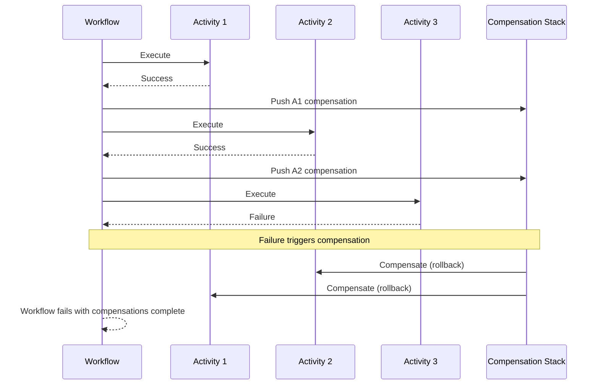

#### Basic Compensation Usage

```typescript
const transferMoneyWorkflow = workflow.toLayer((payload, executionId) =>
  Effect.gen(function* () {
    const { fromAccount, toAccount, amount } = payload
    
    // Debit source account with compensation
    const debitResult = yield* debitAccountActivity({ 
      accountId: fromAccount, 
      amount 
    }).pipe(
      Workflow.withCompensation((result, cause) =>
        Effect.gen(function* () {
          yield* Effect.log(`Compensating debit: refunding ${amount} to ${fromAccount}`)
          yield* creditAccountActivity({ 
            accountId: fromAccount, 
            amount,
            reason: "Transfer failed - automatic refund"
          })
        })
      )
    )
    
    // Credit destination account with compensation
    const creditResult = yield* creditAccountActivity({ 
      accountId: toAccount, 
      amount 
    }).pipe(
      Workflow.withCompensation((result, cause) =>
        Effect.gen(function* () {
          yield* Effect.log(`Compensating credit: reversing ${amount} from ${toAccount}`)
          yield* debitAccountActivity({ 
            accountId: toAccount, 
            amount,
            reason: "Transfer failed - automatic reversal"
          })
        })
      )
    )
    
    // If this fails, both compensations run in reverse order
    yield* recordTransferActivity({ 
      from: fromAccount, 
      to: toAccount, 
      amount,
      debitId: debitResult.transactionId,
      creditId: creditResult.transactionId
    })
    
    return { 
      transferId: executionId, 
      status: "completed" 
    }
  })
)
```

#### Advanced Compensation Patterns

**Conditional Compensation**

```typescript
const orderFulfillmentWorkflow = workflow.toLayer((payload, executionId) =>
  Effect.gen(function* () {
    // Reserve inventory with conditional compensation
    const reservation = yield* reserveInventoryActivity(payload.items).pipe(
      Workflow.withCompensation((result, cause) =>
        Effect.gen(function* () {
          // Only compensate if not a validation error
          const shouldCompensate = !Cause.isFailure(cause) || 
            !cause.error._tag.includes("Validation")
          
          if (shouldCompensate) {
            yield* Effect.log(`Releasing inventory reservation ${result.reservationId}`)
            yield* releaseInventoryActivity(result.reservationId)
          }
        })
      )
    )
    
    // Charge payment with smart compensation
    const payment = yield* chargePaymentActivity({
      amount: payload.totalAmount,
      customerId: payload.customerId
    }).pipe(
      Workflow.withCompensation((result, cause) =>
        Effect.gen(function* () {
          const refundAmount = calculateRefundAmount(result, cause)
          
          if (refundAmount > 0) {
            yield* refundPaymentActivity({
              originalTransactionId: result.transactionId,
              amount: refundAmount,
              reason: Cause.pretty(cause)
            })
          }
        })
      )
    )
    
    return { orderId: payload.orderId, status: "fulfilled" }
  })
)
```

**Nested Compensation Scopes**

```typescript
const complexWorkflow = workflow.toLayer((payload, executionId) =>
  Effect.gen(function* () {
    // Outer compensation scope
    const outerResult = yield* Effect.scoped(
      Effect.gen(function* () {
        // Add outer compensation
        yield* Effect.addFinalizer(() =>
          Effect.log("Outer scope compensation")
        )
        
        // Inner compensation scope
        const innerResult = yield* Effect.scoped(
          Effect.gen(function* () {
            // Add inner compensation
            yield* Effect.addFinalizer(() =>
              Effect.log("Inner scope compensation")
            )
            
            // Activities with their own compensations
            yield* activityWithCompensation
            
            return "inner complete"
          })
        )
        
        return { outer: "complete", inner: innerResult }
      })
    )
    
    return outerResult
  })
)
```

### Persistence & Durability

@effect/workflows ensures durability through comprehensive state persistence. Every workflow execution is backed by persistent storage, enabling recovery from failures.

#### State Persistence Architecture

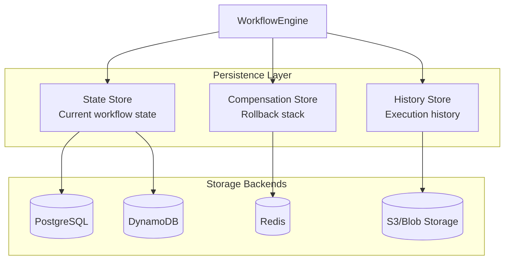

#### Configuring Persistence

**PostgreSQL Backend**

```typescript
import { PostgresStateStore, PostgresHistoryStore } from "@effect/workflows-postgres"

const postgresBackend = Layer.merge(
  PostgresStateStore.layer({
    connectionString: Config.string("DATABASE_URL"),
    schema: "workflows",
    pool: {
      max: 20,
      idleTimeoutMillis: 30000
    }
  }),
  PostgresHistoryStore.layer({
    connectionString: Config.string("DATABASE_URL"),
    schema: "workflows",
    compression: true
  })
)

const engineWithPostgres = WorkflowEngine.layer({
  persistence: {
    stateStore: PostgresStateStore.tag,
    historyStore: PostgresHistoryStore.tag
  }
}).pipe(
  Layer.provide(postgresBackend)
)
```

**DynamoDB Backend**

```typescript
import { DynamoStateStore, S3HistoryStore } from "@effect/workflows-aws"

const awsBackend = Layer.merge(
  DynamoStateStore.layer({
    tableName: Config.string("DYNAMO_TABLE"),
    region: Config.string("AWS_REGION"),
    throughput: {
      read: 10,
      write: 10
    }
  }),
  S3HistoryStore.layer({
    bucket: Config.string("HISTORY_BUCKET"),
    prefix: "workflow-history/",
    compression: "gzip"
  })
)
```

#### State Management Patterns

**Checkpointing**

```typescript
const checkpointedWorkflow = workflow.toLayer((payload, executionId) =>
  Effect.gen(function* () {
    // Process phase 1
    const phase1Result = yield* processPhase1Activity(payload)
    
    // Create checkpoint
    yield* WorkflowInstance.checkpoint({
      phase: "phase1-complete",
      result: phase1Result,
      timestamp: Date.now()
    })
    
    // Long-running operation
    const phase2Result = yield* Effect.forEach(
      phase1Result.items,
      (item, index) => 
        Effect.gen(function* () {
          const result = yield* processItemActivity(item)
          
          // Checkpoint progress
          if (index % 100 === 0) {
            yield* WorkflowInstance.checkpoint({
              phase: "phase2-progress",
              processed: index,
              total: phase1Result.items.length
            })
          }
          
          return result
        }),
      { concurrency: 5 }
    )
    
    return { phase1: phase1Result, phase2: phase2Result }
  })
)
```

**State Versioning**

```typescript
// Version 1 of workflow
const orderWorkflowV1 = Workflow.make({
  name: "process-order",
  version: 1,
  payload: OrderPayloadV1,
  migrate: undefined
})

// Version 2 with migration
const orderWorkflowV2 = Workflow.make({
  name: "process-order", 
  version: 2,
  payload: OrderPayloadV2,
  migrate: (v1State: any) => ({
    ...v1State,
    newField: "default-value",
    renamedField: v1State.oldField
  })
})
```

### Error Handling & Recovery

@effect/workflows provides sophisticated error handling mechanisms that integrate with Effect's error model while adding workflow-specific recovery capabilities.

#### Error Types and Handling

**Activity-Level Errors**

```typescript
const robustActivity = Activity.make({
  name: "external-api-call",
  error: Schema.Union(
    Schema.Struct({ _tag: Schema.Literal("NetworkError"), retryable: Schema.Literal(true) }),
    Schema.Struct({ _tag: Schema.Literal("RateLimitError"), retryAfter: Schema.Number }),
    Schema.Struct({ _tag: Schema.Literal("ValidationError"), retryable: Schema.Literal(false) })
  ),
  execute: Effect.gen(function* () {
    const attempt = yield* Activity.currentAttempt
    
    return yield* callAPI().pipe(
      Effect.catchTags({
        NetworkError: (error) => 
          attempt < 3 
            ? Effect.fail({ ...error, retryable: true })
            : Effect.fail({ ...error, retryable: false }),
            
        RateLimitError: (error) =>
          Effect.fail({ 
            _tag: "RateLimitError", 
            retryAfter: error.retryAfter 
          }),
          
        ValidationError: (error) =>
          Effect.fail({ ...error, retryable: false })
      })
    )
  })
})
```

**Workflow-Level Error Recovery**

```typescript
const errorRecoveryWorkflow = workflow.toLayer((payload, executionId) =>
  Effect.gen(function* () {
    // Try primary flow
    const result = yield* Effect.catchTags(
      primaryWorkflowFlow(payload),
      {
        TemporaryError: (error) => 
          Effect.gen(function* () {
            yield* Effect.log(`Temporary error, using fallback: ${error}`)
            return yield* fallbackWorkflowFlow(payload)
          }),
          
        PartialFailure: (error) =>
          Effect.gen(function* () {
            yield* Effect.log(`Partial failure, attempting recovery`)
            const recovered = yield* recoveryFlow(error.successfulParts)
            return { ...error.successfulParts, ...recovered }
          })
      }
    )
    
    return result
  })
)
```

#### Retry Strategies

**Activity Retry Configuration**

```typescript
const retryableActivity = Activity.make({
  name: "retryable-operation",
  execute: externalOperation
}).pipe(
  Activity.retry(
    Schedule.exponential("100 millis").pipe(
      Schedule.jittered,
      Schedule.whileOutput(Duration.lessThanOrEqualTo(Duration.minutes(5))),
      Schedule.recurs(10)
    )
  )
)

// Custom retry based on error type
const smartRetryActivity = Activity.make({
  name: "smart-retry",
  execute: operation
}).pipe(
  Activity.retry((error, attempt) => {
    if (error._tag === "RateLimitError") {
      return Schedule.spaced(Duration.millis(error.retryAfter))
    }
    if (error._tag === "NetworkError") {
      return Schedule.exponential("1 second").pipe(Schedule.recurs(5))
    }
    return Schedule.stop
  })
)
```

**Workflow Suspension and Resume**

```typescript
const suspendableWorkflow = Workflow.make({
  name: "suspendable-process",
  payload: SuspendablePayload,
  suspendOnFailure: true,
  suspendedRetrySchedule: Schedule.spaced("1 hour").pipe(
    Schedule.dayOfWeek(1, 2, 3, 4, 5) // Weekdays only
  )
})

// Manual suspension
const manualSuspensionWorkflow = workflow.toLayer((payload, executionId) =>
  Effect.gen(function* () {
    const approval = yield* checkApprovalActivity
    
    if (!approval.approved) {
      // Suspend workflow until manual intervention
      yield* WorkflowInstance.suspend({
        reason: "Awaiting manual approval",
        resumeAfter: Duration.hours(24)
      })
    }
    
    // Continue after resume
    yield* processApprovedActivity
  })
)
```

### Scheduling & Timing

@effect/workflows integrates with Effect's scheduling system to provide sophisticated timing control.

#### Delayed Activities

```typescript
const delayedWorkflow = workflow.toLayer((payload, executionId) =>
  Effect.gen(function* () {
    // Immediate processing
    const order = yield* createOrderActivity
    
    // Delay before payment
    yield* Effect.sleep("5 minutes")
    const payment = yield* chargePaymentActivity
    
    // Schedule future activity
    yield* scheduleShipmentActivity.pipe(
      Effect.delay(Duration.hours(payload.processingTime))
    )
    
    return { orderId: order.id, status: "scheduled" }
  })
)
```

#### Timeout Management

```typescript
const timeoutWorkflow = workflow.toLayer((payload, executionId) =>
  Effect.gen(function* () {
    // Activity with timeout
    const result = yield* longRunningActivity.pipe(
      Effect.timeout("5 minutes"),
      Effect.catchTag("TimeoutException", () =>
        Effect.succeed({ status: "timeout", partial: true })
      )
    )
    
    // Workflow section timeout
    const batchResult = yield* Effect.timeout(
      processBatchActivity(payload.items),
      "30 minutes"
    ).pipe(
      Effect.orElse(() => 
        // Fallback for timeout
        processPartialBatchActivity(payload.items.slice(0, 10))
      )
    )
    
    return { result, batchResult }
  })
)
```

#### Recurring Workflows

```typescript
const recurringWorkflow = Workflow.make({
  name: "daily-report",
  payload: Schema.Struct({ date: Schema.Date }),
  schedule: Schedule.cron("0 9 * * *"), // Daily at 9 AM
  idempotencyKey: (payload) => 
    `daily-report-${payload.date.toISOString().split('T')[0]}`
})

// Self-scheduling workflow
const selfSchedulingWorkflow = workflow.toLayer((payload, executionId) =>
  Effect.gen(function* () {
    // Process current iteration
    const result = yield* processDataActivity(payload)
    
    // Schedule next iteration if needed
    if (result.hasMore) {
      yield* WorkflowEngine.schedule(
        workflow,
        { ...payload, offset: result.nextOffset },
        { delay: Duration.minutes(5) }
      )
    }
    
    return result
  })
)
```

---

## Architecture & Data Flow

### Workflow Execution Lifecycle

Understanding the workflow execution lifecycle is crucial for building reliable systems with @effect/workflows. The following diagram illustrates the complete lifecycle from creation to completion:

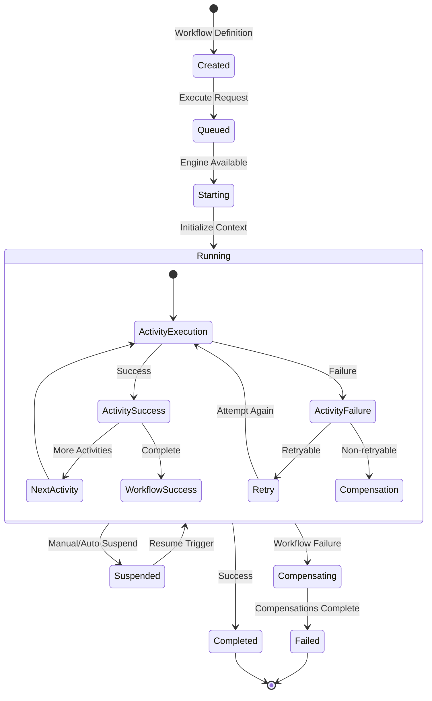

### State Persistence Flow

Every workflow execution maintains durable state through a sophisticated persistence mechanism:

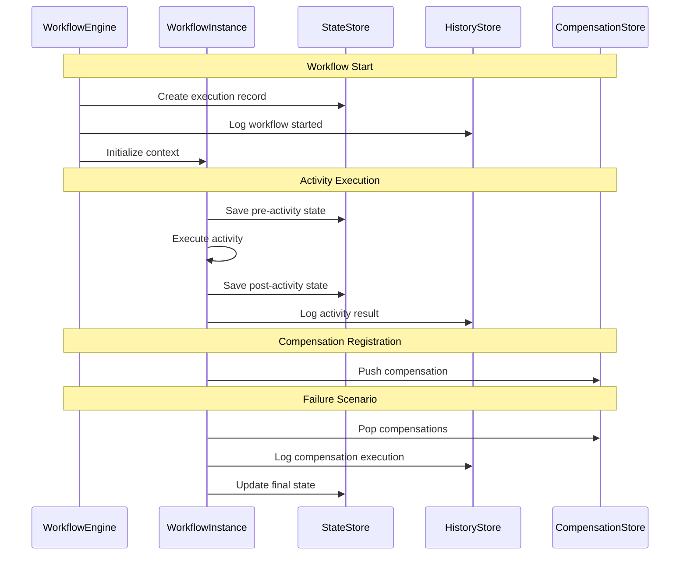

### Data Flow Patterns

#### Sequential Processing

```typescript
const sequentialWorkflow = workflow.toLayer((payload, executionId) =>
  Effect.gen(function* () {
    // Each step depends on the previous
    const step1 = yield* validateInputActivity(payload)
    const step2 = yield* processDataActivity(step1.validatedData)
    const step3 = yield* enrichDataActivity(step2.processedData)
    const step4 = yield* finalizeActivity(step3.enrichedData)
    
    return step4
  })
)
```

**State Flow Diagram:**

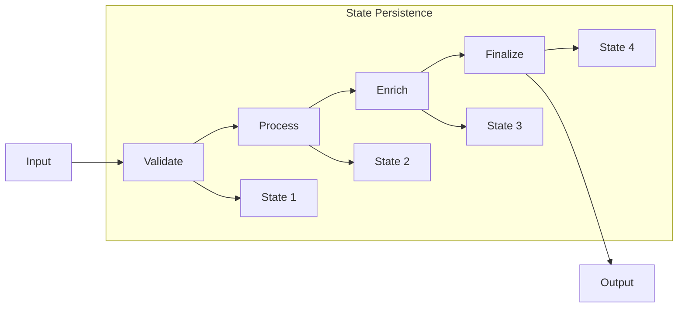

#### Parallel Processing with Synchronization

```typescript
const parallelWorkflow = workflow.toLayer((payload, executionId) =>
  Effect.gen(function* () {
    // Independent parallel branches
    const [userProfile, paymentInfo, shippingInfo] = yield* Effect.all([
      fetchUserProfileActivity(payload.userId),
      processPaymentActivity(payload.paymentData),
      calculateShippingActivity(payload.shippingData)
    ], { concurrency: "unbounded" })
    
    // Synchronization point
    const orderSummary = yield* createOrderSummaryActivity({
      profile: userProfile,
      payment: paymentInfo,
      shipping: shippingInfo
    })
    
    // Dependent final steps
    const [inventory, notification] = yield* Effect.all([
      updateInventoryActivity(orderSummary.items),
      sendConfirmationActivity(orderSummary)
    ])
    
    return { orderSummary, inventory, notification }
  })
)
```

**Parallel Flow Diagram:**

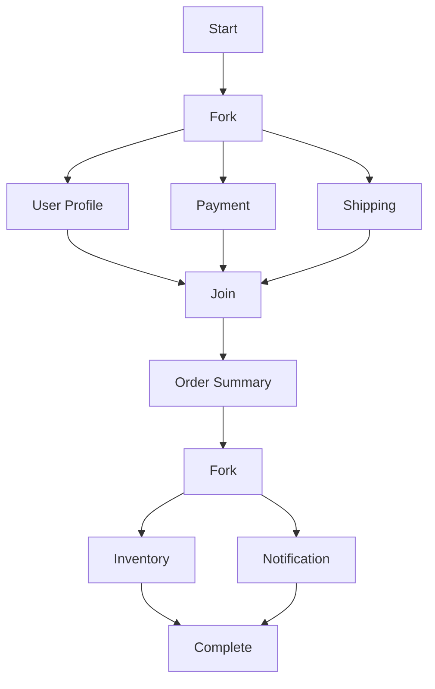

#### Event-Driven Processing

```typescript
const eventDrivenWorkflow = workflow.toLayer((payload, executionId) =>
  Effect.gen(function* () {
    // Initial processing
    const initialResult = yield* processInitialActivity(payload)
    
    // Wait for external event
    const externalEvent = yield* WorkflowInstance.waitForEvent("approval", {
      timeout: Duration.hours(24)
    })
    
    if (externalEvent.approved) {
      yield* processApprovalActivity(initialResult, externalEvent)
    } else {
      yield* processRejectionActivity(initialResult, externalEvent.reason)
    }
    
    return { status: externalEvent.approved ? "approved" : "rejected" }
  })
)
```

### Compensation Stack Management

The compensation mechanism maintains a stack-based approach to rollback operations:

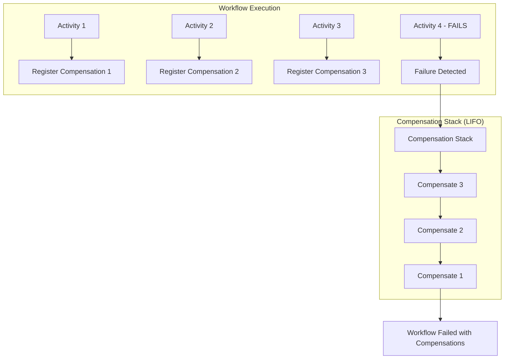

### Memory and Resource Management

@effect/workflows implements sophisticated resource management patterns:

#### Resource Lifecycle

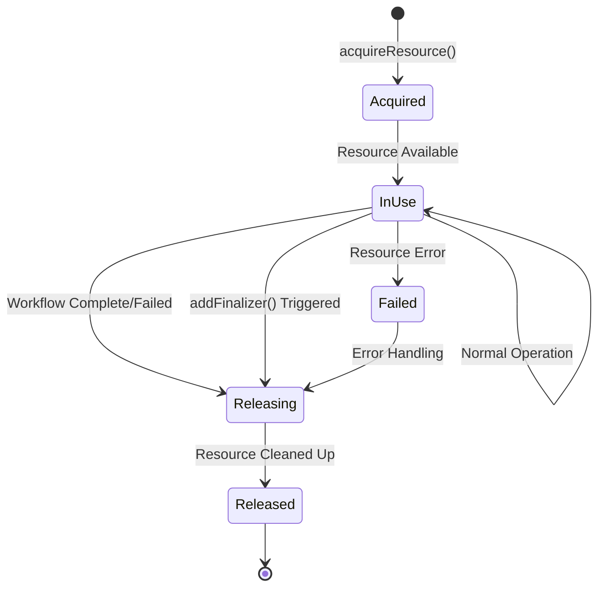

#### Memory Management Strategy

```typescript
const resourceManagedWorkflow = workflow.toLayer((payload, executionId) =>
  Effect.gen(function* () {
    // Acquire resources with automatic cleanup
    const dbConnection = yield* Effect.acquireUseRelease(
      Database.connect(),
      (conn) => Effect.succeed(conn),
      (conn) => conn.close()
    )
    
    // Large data processing with streaming
    const processedData = yield* Stream.fromIterable(payload.largeDataset)
      .pipe(
        Stream.mapEffect((item) => processItemActivity(item)),
        Stream.runCollect,
        Stream.chunkAll(1000) // Process in chunks
      )
    
    // Resource cleanup happens automatically
    return { processed: processedData.length }
  })
)
```

### Distributed Execution Architecture

For production deployments, @effect/workflows supports distributed execution:

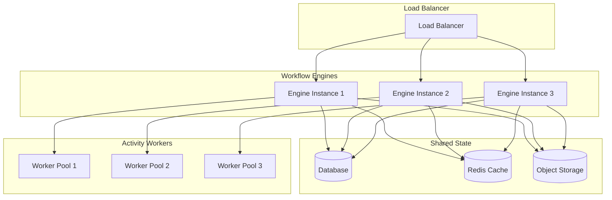

### Performance Characteristics

#### Throughput Optimization

```typescript
const highThroughputEngine = WorkflowEngine.layer({
  execution: {
    maxConcurrentWorkflows: 1000,
    maxConcurrentActivities: 500,
    batchSize: 100,
    queueLength: 10000
  },
  
  persistence: {
    batchWrites: true,
    batchSize: 50,
    flushInterval: Duration.millis(100)
  },
  
  optimization: {
    enableCompression: true,
    enableCaching: true,
    cacheSize: 10000,
    cacheTTL: Duration.minutes(5)
  }
})
```

#### Latency Optimization

```typescript
const lowLatencyEngine = WorkflowEngine.layer({
  execution: {
    // Fewer concurrent workflows for lower latency
    maxConcurrentWorkflows: 100,
    // More aggressive activity execution
    maxConcurrentActivities: 200,
    // Immediate processing
    batchSize: 1
  },
  
  persistence: {
    // Immediate writes for consistency
    batchWrites: false,
    // In-memory caching for speed
    enableMemoryCache: true
  }
})
```

---

## Practical Examples

### Example 1: E-commerce Order Processing Workflow

This comprehensive example demonstrates a complete e-commerce order processing workflow with multiple activities, compensation logic, and error handling.

```typescript
import { Workflow, Activity, WorkflowEngine, Schema } from "@effect/workflows"
import { Effect, Layer, Duration, Schedule } from "effect"

// Domain Types
const OrderItem = Schema.Struct({
  productId: Schema.String,
  quantity: Schema.Number,
  price: Schema.Number,
  name: Schema.String
})

const OrderPayload = Schema.Struct({
  orderId: Schema.String,
  customerId: Schema.String,
  items: Schema.Array(OrderItem),
  totalAmount: Schema.Number,
  priority: Schema.Union(Schema.Literal("standard"), Schema.Literal("express"))
})

// Service Definitions
class PaymentService extends Effect.Service<PaymentService>()("PaymentService", {
  effect: Effect.gen(function* () {
    const charge = (amount: number, customerId: string) =>
      Effect.gen(function* () {
        yield* Effect.sleep("2 seconds")
        
        if (Math.random() < 0.05) {
          return yield* Effect.fail({
            _tag: "PaymentError" as const,
            reason: "Card declined"
          })
        }
        
        return {
          transactionId: `txn-${Date.now()}`,
          amount,
          status: "completed" as const
        }
      })

    const refund = (transactionId: string, amount: number, reason: string) =>
      Effect.gen(function* () {
        yield* Effect.log(`Refunding ${transactionId}: ${reason}`)
        return { refundId: `ref-${Date.now()}`, amount }
      })

    return { charge, refund } as const
  })
}) {}

// Activities
const chargePaymentActivity = Activity.make({
  name: "charge-payment",
  success: Schema.Struct({
    transactionId: Schema.String,
    amount: Schema.Number,
    status: Schema.Literal("completed")
  }),
  execute: Effect.gen(function* () {
    const payment = yield* PaymentService
    const payload = yield* WorkflowInstance.payload(OrderPayload)
    
    return yield* payment.charge(payload.totalAmount, payload.customerId)
  })
})

// Main Workflow
const processOrderWorkflow = Workflow.make({
  name: "process-order",
  payload: OrderPayload,
  success: Schema.Struct({
    orderId: Schema.String,
    status: Schema.Literal("completed"),
    paymentId: Schema.String
  }),
  idempotencyKey: (payload) => payload.orderId
})

const processOrderImpl = processOrderWorkflow.toLayer((payload, executionId) =>
  Effect.gen(function* () {
    yield* Effect.log(`Processing order ${payload.orderId}`)
    
    // Charge payment with compensation
    const payment = yield* chargePaymentActivity.pipe(
      Workflow.withCompensation((result, cause) =>
        Effect.gen(function* () {
          const paymentService = yield* PaymentService
          yield* paymentService.refund(
            result.transactionId,
            result.amount,
            `Order ${payload.orderId} failed`
          )
        })
      )
    )
    
    return {
      orderId: payload.orderId,
      status: "completed" as const,
      paymentId: payment.transactionId
    }
  })
)
```

### Example 2: Financial Transaction Processing

This example shows a financial transaction workflow with comprehensive error handling and compliance checks.

```typescript
// Financial Transfer Workflow
const transferPayload = Schema.Struct({
  transactionId: Schema.String,
  fromAccount: Schema.String,
  toAccount: Schema.String,
  amount: Schema.Number,
  currency: Schema.String
})

const financialTransferWorkflow = Workflow.make({
  name: "financial-transfer",
  payload: transferPayload,
  success: Schema.Struct({
    transactionId: Schema.String,
    status: Schema.Literal("completed"),
    debitId: Schema.String,
    creditId: Schema.String
  }),
  idempotencyKey: (payload) => payload.transactionId
})

const transferImpl = financialTransferWorkflow.toLayer((payload, executionId) =>
  Effect.gen(function* () {
    // Debit source account with compensation
    const debitResult = yield* debitAccountActivity.pipe(
      Workflow.withCompensation((result, cause) =>
        Effect.gen(function* () {
          yield* creditAccountActivity({ 
            accountId: payload.fromAccount,
            amount: payload.amount 
          })
          yield* Effect.log(`Compensated: Refunded ${payload.amount}`)
        })
      )
    )
    
    // Credit destination account with compensation  
    const creditResult = yield* creditAccountActivity.pipe(
      Workflow.withCompensation((result, cause) =>
        Effect.gen(function* () {
          yield* debitAccountActivity({
            accountId: payload.toAccount,
            amount: payload.amount
          })
          yield* Effect.log(`Compensated: Reversed credit`)
        })
      )
    )
    
    return {
      transactionId: payload.transactionId,
      status: "completed" as const,
      debitId: debitResult.transactionId,
      creditId: creditResult.transactionId
    }
  })
)
```

---

## Advanced Patterns & Best Practices

### Long-Running Workflow Patterns

**Human-in-the-Loop Approval**

```typescript
const approvalWorkflow = Workflow.make({
  name: "approval-workflow", 
  payload: Schema.Struct({
    requestId: Schema.String,
    amount: Schema.Number,
    approvers: Schema.Array(Schema.String)
  }),
  idempotencyKey: (payload) => payload.requestId
})

const approvalImpl = approvalWorkflow.toLayer((payload, executionId) =>
  Effect.gen(function* () {
    // Send approval requests
    yield* sendApprovalRequestsActivity
    
    // Wait for approvals with timeout
    const approvals = yield* WorkflowInstance.waitForEvents(
      payload.approvers.map(a => `approval-${a}`),
      { timeout: Duration.days(3) }
    )
    
    if (approvals.every(a => a.approved)) {
      return { status: "approved" as const }
    } else {
      return { status: "rejected" as const }
    }
  })
)
```

### Performance Optimization

**Workflow Batching**

```typescript
const batchProcessor = Workflow.make({
  name: "batch-processor",
  payload: Schema.Struct({
    items: Schema.Array(Schema.Unknown),
    batchSize: Schema.Number
  }),
  idempotencyKey: (payload) => `batch-${payload.items.length}`
})

const batchImpl = batchProcessor.toLayer((payload, executionId) =>
  Effect.gen(function* () {
    const batches = chunk(payload.items, payload.batchSize)
    
    const results = yield* Effect.forEach(
      batches,
      (batch) => processBatchActivity(batch),
      { concurrency: 5 }
    )
    
    return { processed: results.flat().length }
  })
)
```

### Testing Strategies

**Test-Friendly Design**

```typescript
// Mock services for testing
const createTestServices = () => ({
  payment: {
    charge: () => Effect.succeed({ transactionId: "test-123" })
  },
  inventory: {
    reserve: () => Effect.succeed({ reservationId: "res-123" })
  }
})

// Test workflow execution
const testWorkflow = Effect.gen(function* () {
  const result = yield* processOrderWorkflow.execute({
    orderId: "test-order",
    customerId: "test-customer", 
    items: [],
    totalAmount: 100
  })
  
  expect(result.status).toBe("completed")
})
```

### Production Considerations

**Monitoring and Alerting**

```typescript
const monitoredWorkflow = workflow.toLayer((payload, executionId) =>
  Effect.gen(function* () {
    return yield* Effect.withSpan("order-processing")(
      Effect.gen(function* () {
        yield* Metrics.counter("workflow.started").increment()
        
        const result = yield* processOrder(payload)
        
        yield* Metrics.counter("workflow.completed").increment()
        return result
      })
    )
  })
)
```

### Error Handling Best Practices

**Graceful Degradation**

```typescript
const resilientWorkflow = workflow.toLayer((payload, executionId) =>
  Effect.gen(function* () {
    // Try primary flow with fallback
    const result = yield* primaryProcessing(payload).pipe(
      Effect.orElse(() => fallbackProcessing(payload))
    )
    
    return result
  })
)
```

---

## Conclusion

@effect/workflows provides a powerful foundation for building durable, reliable workflow systems. Its key strengths include:

### Core Benefits

- **Durability**: Automatic state persistence ensures workflows survive failures and restarts
- **Type Safety**: Full TypeScript support with Schema validation for all workflow components
- **Compensation Support**: Built-in saga pattern implementation for complex rollback scenarios
- **Effect Integration**: Seamless integration with Effect's ecosystem of services and utilities
- **Scalability**: Designed for distributed execution with configurable concurrency and persistence

### When to Use @effect/workflows

@effect/workflows excels in scenarios requiring:

- **Long-running processes**: Multi-step business processes that may take hours or days
- **Distributed transactions**: Operations spanning multiple services with rollback requirements
- **Human approval workflows**: Processes requiring manual intervention or approval steps
- **Batch processing**: Large-scale data processing with checkpointing and recovery
- **Financial transactions**: Money movement with strict consistency and audit requirements

### Architecture Recommendations

- **Service Design**: Organize business logic into well-defined Effect services
- **Activity Composition**: Break complex workflows into small, testable activities
- **Error Strategy**: Design comprehensive error handling with appropriate compensation
- **Persistence**: Choose appropriate storage backends based on scale and durability needs
- **Monitoring**: Implement observability at both workflow and activity levels

### Production Readiness

@effect/workflows is built for production use with:

- **Horizontal Scaling**: Multiple engine instances with shared state
- **Fault Tolerance**: Automatic recovery from engine failures
- **Performance Tuning**: Configurable concurrency and batching options
- **Security**: Type-safe operations with no runtime surprises
- **Observability**: Built-in metrics, tracing, and logging integration

This comprehensive overview demonstrates @effect/workflows' capabilities for building robust, type-safe workflow systems that can handle complex business requirements while maintaining reliability and observability.
